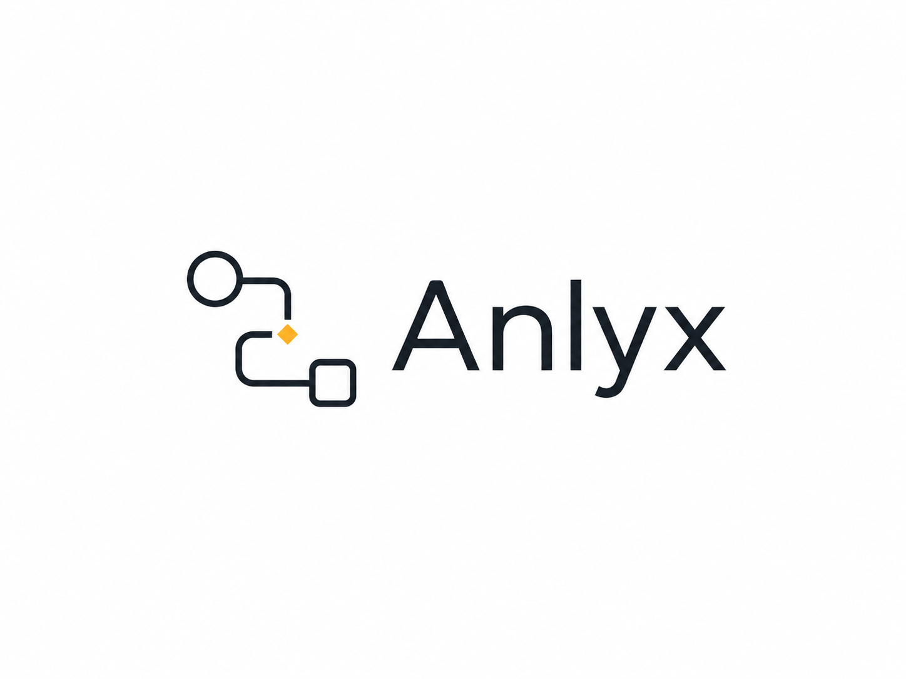
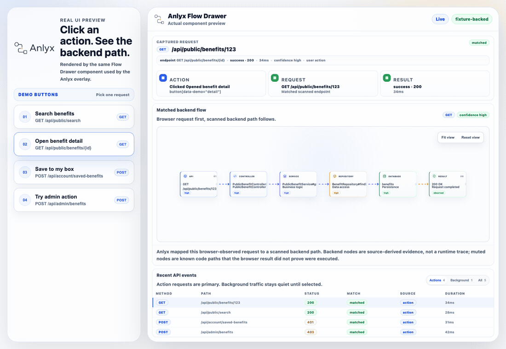

<p align="center">
  
</p>

<p align="center">
  <strong>실제 프론트엔드 액션이 백엔드 어디까지 갔는지 보여주는 flow map.</strong>
</p>

<p align="center">
  <a href="./README.md">English README</a>
</p>

Anlyx는 실제 로컬 프론트엔드 앱 위에 오버레이를 띄우고, 방금 누른 버튼이나 컴포넌트에서 발생한 API가 어떤 백엔드 엔드포인트, 서비스, Repository, 데이터베이스 테이블, 캡처 상태, 정적 분석 근거와 연결되는지 보여주는 개발자 도구입니다.

> 현재 상태: v0.1.3 patch release 준비 단계입니다. 실제 npm publish는 별도 승인 후 진행합니다.

Anlyx `0.1.0`은 `workspace:*` dependency가 남아 있는 상태로 배포되어 deprecated 처리 예정입니다. Anlyx `0.1.1`은 배포된 CLI entrypoint가 명령 실행 전에 종료될 수 있어 deprecated 처리 예정입니다. `v0.1.2` git tag는 이미 존재하므로, 승인된 pnpm 기반 publish 이후에는 `0.1.3`부터 일반 `npm install anlyx`로 설치 가능한 버전으로 안내합니다.

<p align="center">
  
</p>

## 왜 다른가?

- 실제 앱은 자기 localhost 포트에서 그대로 실행됩니다. Anlyx가 프론트엔드를 proxy-only mock viewer로 대체하지 않습니다.
- 마지막 click, submit, key action이 main flow가 됩니다. page-load auth check, health check, polling은 기록하되 사용자가 선택하기 전까지 조용히 분리합니다.
- 브라우저에서 발생한 API를 스캔된 백엔드 코드와 매칭해 diagram으로 보여줍니다. 단순 network log table이 아닙니다.
- 주입되는 launcher는 작고 이동 가능해서, Flow Drawer를 열기 전까지 host app 사용을 방해하지 않습니다.

## What is Anlyx?

Anlyx는 보통 라우트, Swagger/OpenAPI, 백엔드 코드, 데이터베이스 모델, 스크린샷을 오가며 확인해야 하는 질문에 답합니다.

- 이 화면은 어떤 API를 호출하는가?
- 이 API는 어떤 Controller, Service, Repository, DB Table과 연결되는가?
- 어떤 호출이 핵심 경로이고 어떤 호출이 보조 흐름인가?
- API 호출 시점의 화면 상태는 어떻게 캡처되었는가?
- Anlyx가 이 node, edge, confidence를 왜 그렇게 추론했는가?

## Current Support

Deep Support:

- Spring Boot backend endpoint 및 flow scanning
- Next.js App Router page discovery 및 Playwright capture

Basic Support:

- OpenAPI backend endpoint import
- OpenAPI-only 프로젝트를 위한 manual frontend URLs

v0.1 Deep Support는 Spring Boot + Next.js App Router로 제한합니다. FastAPI, Express, NestJS, React Router는 v0.1 Deep Support 대상이 아닙니다.

## Quick Start

### Install

승인된 0.1.3 publish 이후:

```bash
npm install -D anlyx@0.1.3
npx anlyx init
npx anlyx dev
```

Anlyx의 목표 개발 경험은 이 3단계입니다. 설치하고, 설정을 만들고, `npx anlyx dev` 하나로 분석 데이터 준비, Anlyx runtime 실행, 실제 로컬 프론트엔드 열기, 개발 overlay 연결까지 처리하는 방향입니다.

publish 전 로컬 workspace에서는 다음처럼 사용합니다.

```bash
corepack pnpm install
corepack pnpm build
corepack pnpm --filter anlyx exec anlyx --help
```

### Initialize config

```bash
npx anlyx init
```

기본 `anlyx.config.ts`는 import가 없는 plain object입니다. 따라서 scan 대상 프로젝트가 `defineConfig`를 import하려고 `anlyx`를 해석하지 못하는 문제를 피할 수 있습니다.

### Minimal config

```ts
export default {
  projectName: "my-app",
  backend: {
    type: "spring",
    sourceDir: "./backend"
  },
  frontend: {
    type: "next",
    sourceDir: "./frontend",
    baseUrl: "http://localhost:3000"
  },
  server: {
    port: 4777,
    openBrowser: true,
    mode: "inject"
  },
  dev: {
    command: "npm run dev"
  }
};
```

대상 프로젝트에서 `anlyx`를 devDependency로 해석할 수 있다면 선택적으로 type helper를 사용할 수 있습니다.

```ts
import { defineConfig } from "anlyx";

export default defineConfig({
  projectName: "my-app"
});
```

### Monorepo example: Spring Boot backend + Next.js frontend

```txt
my-app/
  backend/
    src/main/java/...
  frontend/
    src/app/...
```

권장 config:

```ts
export default {
  projectName: "my-app",
  backend: {
    type: "spring",
    sourceDir: "./backend"
  },
  frontend: {
    type: "next",
    sourceDir: "./frontend",
    baseUrl: "http://localhost:3000"
  }
};
```

Spring adapter는 `./backend`에서 `./backend/src/main/java`를 찾습니다. Next adapter는 `./frontend/app`을 먼저 보고, 없으면 `./frontend/src/app`을 찾습니다.

### First scan without capture

```bash
npx anlyx scan --skip-capture
```

이 명령은 정적 adapter 결과만 사용해 `.anlyx/report-data.json`을 생성합니다. capture를 실행하기 전의 page는 `pending` 상태로 남습니다.

### Open local overlay

```bash
npx anlyx dev
```

최종 목표는 로컬 개발 중 사용자가 `anlyx dev` 하나만 실행하면 되는 것입니다. 이 명령은 실제 프론트엔드를 감지하거나 실행하고, 앱은 `frontend.baseUrl`에 그대로 둔 채, [http://localhost:4777](http://localhost:4777)에 Anlyx runtime을 띄우고 실제 앱 URL을 엽니다.

Next.js App Router 앱에서는 root layout에 개발 전용 helper를 추가합니다.

```tsx
import { AnlyxDevOverlay } from "anlyx/next";

export default function RootLayout({ children }: { children: React.ReactNode }) {
  return (
    <html>
      <body>
        {children}
        <AnlyxDevOverlay />
      </body>
    </html>
  );
}
```

`AnlyxDevOverlay`는 production에서 아무것도 렌더링하지 않습니다. production build에 overlay script가 들어가지 않게 막고, 개발 중에만 로컬 overlay script를 렌더링합니다.

특수한 환경에서는 아래 raw fallback script를 직접 사용할 수 있습니다.

```html
<script src="http://localhost:4777/_anlyx/overlay.js" defer></script>
```

앱은 자기 origin에서 그대로 실행되므로 auth, theme, cookie, localStorage, hydration 동작이 평소 개발환경과 달라지지 않습니다.

- 실제 앱을 평소처럼 클릭합니다.
- 브라우저 `fetch` 또는 `XMLHttpRequest` API 호출이 발생하면 Anlyx가 스캔된 엔드포인트와 매칭합니다.
- Anlyx 버튼은 matched request, main path, support calls, confidence, linked pages, evidence를 보여주는 우측 Flow Drawer를 엽니다.

Standalone debug viewer는 [http://localhost:4777/\_anlyx/viewer](http://localhost:4777/_anlyx/viewer)에서 계속 사용할 수 있습니다.

- Flow Story: matched frontend page preview, API endpoint, backend flow graph, inspector evidence, calls, metadata, Replay Lite controls를 한 화면에서 보여주는 request-centric workspace.
- Structure: Endpoint에서 Controller, Service, Repository, Database로 이어지는 backend API structure.
- Captures: frontend page storyboard, capture status, API calls, linked backend endpoints. `--skip-capture`를 사용하면 page는 `pending`으로 남고, viewer는 이 상태를 숨기지 않고 제품형 empty storyboard로 보여줍니다.
- Process: scanned static flow graph에서 파생한 request/response replay, inferred request path, branch calls, database arrival, return path. runtime tracing은 아닙니다.

Standalone viewer를 `/`에서 바로 보고 싶다면 `server.mode: "viewer"`를 사용합니다. `server.mode: "overlay"`는 fallback/debug proxy mode로 남기지만, 기본 제품 경로는 Inject Mode입니다.

v0.1 경험은 request-centric architecture viewer입니다. 하나의 endpoint가 어떻게 구성되어 있고, 어떤 frontend page와 연결되며, Anlyx가 각 단계를 왜 추론했는지와 scan된 request flow가 애플리케이션 안에서 어떻게 이동하는지 보여줍니다.

뷰어는 React Flow를 그래프 엔진으로 유지하고, 그 위에 필요한 시각 시스템만 얹습니다.

- `elkjs`: left-to-right graph layout과 deterministic fallback 배치.
- `motion`: active node pulse, replay step transition, 절제된 flow movement.
- `react-resizable-panels`: resize/collapse 가능한 3-panel shell.
- `lucide-react`: endpoint, service, repository, database, replay, panel icon 통일.

이 라이브러리들은 diagram readability를 높이기 위한 것이며 runtime tracing, Java agent, OpenTelemetry, 새 graph engine을 추가하지 않습니다.

### Capture mode

프론트엔드 앱을 먼저 실행한 뒤 `--skip-capture` 없이 scan합니다.

```bash
npx anlyx scan
```

capture는 `frontend.baseUrl`을 기준으로 페이지를 방문하고 screenshot/API-call 데이터를 `.anlyx/report-data.json`에 기록합니다.

### Dynamic routes and sampleParams

Next.js 동적 라우트는 capture가 방문할 실제 URL을 만들 수 있도록 sample params를 제공합니다.

```ts
export default {
  frontend: {
    type: "next",
    sourceDir: "./frontend",
    baseUrl: "http://localhost:3000",
    sampleParams: {
      "/benefit/[brandSlug]/[benefitSlugWithId]": {
        brandSlug: "starbucks",
        benefitSlugWithId: "birthday-coupon-123"
      }
    }
  }
};
```

## Troubleshooting

### Cannot find module 'anlyx'

`npx anlyx init --force`로 생성되는 import-free config를 사용합니다. `defineConfig` import는 대상 프로젝트가 `anlyx`를 devDependency로 설치하고 해석할 수 있을 때만 사용합니다.

### Next.js App Router directory not found

`frontend.sourceDir`를 frontend root 또는 source root로 지정합니다. v0.1에서 지원하는 구조는 다음과 같습니다.

```txt
frontend/app
frontend/src/app
sourceDir이 ./frontend/src일 때 ./frontend/src/app
```

### .anlyx/report-data.json not generated

먼저 다음 명령으로 정적 scan을 확인합니다.

```bash
npx anlyx scan --skip-capture
```

실패하면 config 경로, backend source directory, frontend app directory, 터미널 에러를 확인합니다. `anlyx dev`는 report data가 없을 때 lightweight scan을 실행하지만, scan 문제만 분리해서 볼 때는 `anlyx scan --skip-capture`가 여전히 유용합니다.

### Pages are pending

`--skip-capture`, manual frontend URLs, capture data가 없는 route에서는 정상입니다. Pending page는 숨기지 않고 뷰어에 표시합니다.

### Playwright/capture fails

프론트엔드 서버가 `frontend.baseUrl`에서 실행 중인지, dynamic route에 `sampleParams`가 있는지, 로그인 전용 페이지에 capture 설정이 있는지 확인합니다. capture 문제를 분리하려면 `--skip-capture`로 정적 scan을 먼저 실행합니다.

### 0.1.0 workspace dependency issue

`anlyx@0.1.0`은 사용하지 마세요. unresolved `workspace:*` dependency가 포함되어 배포되었습니다. 승인된 patch publish 이후 `0.1.3` 이상을 사용합니다.

## v0.1 제외 범위

- FastAPI, Express, NestJS Deep Support
- React Router Deep Support
- Static HTML export
- Mermaid export
- PNG/SVG export
- GitHub Actions report generation
- Java Agent runtime tracing
- LLM flow summary

## Development Setup

Anlyx는 pnpm workspace, TypeScript, ESLint, Prettier, Vitest를 사용합니다.

```bash
corepack pnpm install
corepack pnpm typecheck
corepack pnpm lint
corepack pnpm test
corepack pnpm format
corepack pnpm -r build
```

배포 전 package 검증은 local build와 pack dry-run으로 확인합니다. 자세한 내용은 [`docs/release/npm-publish-preflight.md`](./docs/release/npm-publish-preflight.md)와 [`docs/release/v0.1-release-runbook.md`](./docs/release/v0.1-release-runbook.md)를 참고합니다.

## Release Notes

`v0.1.3` GitHub Release 초안은 [`docs/release/v0.1.3-release-notes.md`](./docs/release/v0.1.3-release-notes.md)에 정리합니다. npm publish 검증이 끝난 뒤 tag와 release를 만들 때 이 문서를 기준으로 사용합니다.
