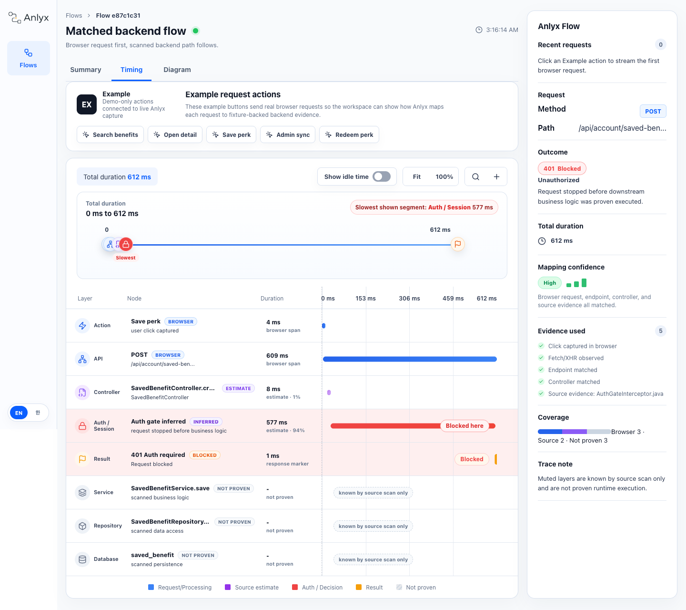

<p align="center">
  
</p>

<h3 align="center">Click the real app. See the backend path.</h3>

<p align="center">
  Action-first flow maps from browser, Next.js server, and Spring Boot dev evidence.
</p>

<p align="center">
  <a href="https://suhannoh.github.io/anlyx/"><strong>Live Demo</strong></a>
  ·
  <a href="#quick-start">Quick Start</a>
  ·
  <a href="#how-it-works">How It Works</a>
  ·
  <a href="./README.ko.md">한국어</a>
</p>

<p align="center">
  <a href="./LICENSE"></a>
  <a href="https://github.com/suhannoh/anlyx/actions/workflows/ci.yml"></a>
  <a href="https://suhannoh.github.io/anlyx/"></a>
</p>

<p align="center">
  
</p>

## What It Does

Anlyx runs beside your local app and answers the question developers usually chase through browser DevTools, Swagger, backend code, and database models:

```txt
I clicked this button. What API fired, and where does it go?
```

It keeps the host app running on its normal localhost port, observes local API activity, and maps each request to scanned backend evidence:

```txt
User action or page load -> API -> Controller -> Service -> Repository -> Database -> Result
```

The diagram is evidence-aware:

- **Browser observed**: local browser `fetch`/XHR requests caused by user actions.
- **Next server observed**: local Next.js server `fetch` calls, including Server Component data loading that the browser cannot see.
- **Backend observed**: development-only Spring Boot bridge spans for Controller, Service, Repository, and JDBC work.
- **Source matched**: scanned code evidence. This is not a runtime trace unless a dev bridge reports spans for the same request.

## Why Developers Use It

| Instead of...                                                    | Anlyx gives you...                                             |
| ---------------------------------------------------------------- | -------------------------------------------------------------- |
| Digging through DevTools network rows                            | The request caused by your latest click, submit, or key action |
| Jumping between route files, Swagger, services, and repositories | One visual path from frontend action to backend flow           |
| Treating health checks and polling as noise                      | Quiet background traffic that stays out of the main flow       |
| Guessing why a node appeared                                     | Confidence and evidence next to the matched flow               |
| Explaining a project by hand                                     | A live workspace that makes onboarding visual                  |

## Quick Start

> Pre-publish note: npm publishing is intentionally paused while v0.1 is being validated on real projects. Use the source workflow below in this repository. The `npm install -D anlyx` path is the intended command after the first npm release.

From this repository:

```bash
corepack pnpm install
corepack pnpm build
corepack pnpm pack:local
```

After npm release:

```bash
npm install -D anlyx
npx anlyx init
npx anlyx dev
```

Before running `npx anlyx dev`, check the generated `anlyx.config.ts`: `backend.sourceDir`, `frontend.sourceDir`, `frontend.baseUrl`, `frontend.router`, and `dev.command` must match your local project. Then use your app normally. Keep Anlyx Workspace open beside it at `http://localhost:4777/_anlyx/viewer`, click a real button or submit a real form, and watch the matched backend flow update live.

## Support Matrix

| Area                       | v0.1 support                                             |
| -------------------------- | -------------------------------------------------------- |
| Backend deep support       | Spring Boot endpoint and flow scanning                   |
| Frontend deep support      | Next.js App Router page discovery and Playwright capture |
| Basic backend support      | OpenAPI endpoint import                                  |
| Basic frontend support     | Manual URLs for OpenAPI-only projects                    |
| Not deep-supported in v0.1 | FastAPI, Express, NestJS, React Router                   |

## Install In A Real App

After the npm package is published, install and create a config:

```bash
npm install -D anlyx
npx anlyx init
```

Minimal `anlyx.config.ts`:

```ts
export default {
  projectName: "my-app",
  backend: {
    type: "spring",
    sourceDir: "./backend"
  },
  frontend: {
    type: "next",
    sourceDir: "./frontend",
    baseUrl: "http://localhost:3000",
    router: "app"
  },
  server: {
    port: 4777,
    openBrowser: true,
    mode: "inject"
  },
  dev: {
    command: "npm run dev"
  }
};
```

Run Anlyx next to your app:

```bash
npx anlyx dev
```

For standard Next.js App Router projects, `anlyx dev` preloads the development-only Next server bridge and opens the Live Workspace. If your local app cannot be launched through `dev.command`, start your app yourself and keep the fallback capture script available in development:

```html
<script src="http://localhost:4777/_anlyx/capture.js" defer></script>
```

Do not use Anlyx in production. The runtime is designed for local development only.

Prerequisites: Node.js 22 or newer. Contributors should use Corepack with the pinned pnpm version from `package.json`. If Playwright capture fails on a fresh machine, install Chromium for the local capture package with `npx playwright install chromium`.

## How It Works

1. Scans Spring Boot endpoints and best-effort Controller -> Service -> Repository paths.
2. Discovers Next.js App Router pages and dynamic route samples.
3. Captures local page states and browser-visible API calls.
4. Observes Next.js server-side `fetch` calls during local development when `anlyx dev` can preload the bridge.
5. Optionally receives Spring Boot dev bridge spans for correlated backend method and JDBC timing.
6. Separates user-action requests from background auth, health, polling, framework, and static asset traffic.
7. Streams the matched request into the full-page Live Workspace with Summary, Timing, Diagram, confidence, and evidence.

## UI Surfaces

| Surface             | Purpose                                                                                   |
| ------------------- | ----------------------------------------------------------------------------------------- |
| Live Workspace      | Primary experience at `http://localhost:4777/_anlyx/viewer` for live request flow review. |
| Capture badge       | Small optional app-side entry point that confirms capture and links back to Workspace.    |
| Capture runtime     | Development-only `fetch`/XHR observer loaded by the app; it does not render a drawer.     |
| Next server bridge  | Development-only `fetch` observer for local Next.js server-side data loading.             |
| Spring dev bridge   | Development-only span reporter for correlated Controller/Service/Repository/JDBC timing.  |
| README / Pages demo | Fixture-backed demo of the same workspace direction, not a hand-drawn mock.               |

## Evidence And Timing

Anlyx deliberately separates measured data from code-derived evidence:

| Label                 | Meaning                                                                                  |
| --------------------- | ---------------------------------------------------------------------------------------- |
| Browser observed      | A local browser request or action was captured. Timing comes from the browser runtime.   |
| Next server observed  | A local Next.js server `fetch` was captured. Timing comes from the Next.js dev process.  |
| Backend observed      | A development-only Spring Boot bridge reported a method or JDBC span.                    |
| Source matched        | The row came from scanned source code. It is useful context, not measured runtime time.  |
| Not proven            | The node exists in scanned code, but Anlyx cannot prove it ran for this request.         |
| Response not observed | Anlyx found source evidence, but no browser or Next server response timing was captured. |

When a value such as `999 ms` appears in Timing, it comes from a captured local runtime event, not a placeholder. Source-only rows are shown as estimates or not-proven rows instead of measured spans.

## Demo Assets

The README image and Live Demo are generated from the same React preview surface:

```bash
corepack pnpm docs:readme-demo
corepack pnpm demo:dev
corepack pnpm demo:build
```

`docs:readme-demo` writes `docs/assets/readme/anlyx-demo.png`. The GitHub Pages demo lives in `apps/demo` and shows the fake app plus Live Workspace product direction. The Pages workflow builds the demo on `main` pushes, while deployment runs only from manual workflow dispatch after GitHub Pages is enabled for the repository.

## Capture And Dynamic Routes

Run a static scan first when you want to debug config without opening Playwright:

```bash
npx anlyx scan --skip-capture
```

Run capture after the frontend is available:

```bash
npx anlyx scan
```

For dynamic Next.js routes, provide `sampleParams` so capture can visit concrete URLs:

```ts
export default {
  frontend: {
    type: "next",
    sourceDir: "./frontend",
    baseUrl: "http://localhost:3000",
    router: "app",
    sampleParams: {
      "/benefit/[brandSlug]/[benefitSlugWithId]": {
        brandSlug: "starbucks",
        benefitSlugWithId: "birthday-coupon-123"
      }
    }
  }
};
```

## Troubleshooting

### Cannot find module 'anlyx'

Use the default import-free config generated by `npx anlyx init --force`. Only import `defineConfig` when the target project installs and resolves `anlyx`.

### Next.js App Router directory not found

Set `frontend.sourceDir` to the frontend root or source root. Supported v0.1 shapes include:

```txt
frontend/app
frontend/src/app
frontend/src/app when sourceDir is ./frontend/src
```

### .anlyx/report-data.json not generated

Run:

```bash
npx anlyx scan --skip-capture
```

If it fails, check the config path, backend source directory, frontend app directory, and the terminal error. `anlyx dev` will run a lightweight scan when report data is missing, but `anlyx scan --skip-capture` is still useful for isolating scan problems.

### Pages are pending

This is expected when using `--skip-capture`, manual frontend URLs, or routes without capture data. Pending pages are intentionally visible in the viewer.

### Playwright or capture fails

Confirm the frontend server is running at `frontend.baseUrl`, dynamic routes have `sampleParams`, and login-only pages have a valid capture setup. Use `--skip-capture` for a static scan while debugging capture.

### Spring Security or CORS blocks the dev bridge

Spring Security filters can return `401` or `403` before a request reaches a Spring MVC controller. In that case Anlyx should show the controller and downstream layers as source evidence or not-proven unless the development bridge reports backend spans. If the bridge cannot correlate requests, allow the local development header `X-Anlyx-Request-Id` in your Spring CORS configuration for the local frontend origin only.

### Package status

npm publish is paused. Before the first public npm release, verify with:

```bash
corepack pnpm build
corepack pnpm test
corepack pnpm pack:local
corepack pnpm pack:smoke
npm pack --dry-run
```

Do not claim a live npm release until the package has actually been published and installed from npm in a clean project.

## Not Included In v0.1

- FastAPI, Express, or NestJS Deep Support
- React Router Deep Support
- Static HTML export
- Mermaid export
- PNG/SVG export
- GitHub Actions report generation
- Java Agent runtime tracing
- LLM flow summaries

## Development Setup

Anlyx uses a pnpm workspace with TypeScript, ESLint, Prettier, and Vitest.

```bash
corepack pnpm install
corepack pnpm typecheck
corepack pnpm lint
corepack pnpm test
corepack pnpm format
corepack pnpm -r build
```

Release packaging is checked with local build and pack dry-runs. See [`docs/release/npm-publish-preflight.md`](./docs/release/npm-publish-preflight.md) and [`docs/release/v0.1-release-runbook.md`](./docs/release/v0.1-release-runbook.md).

## Contributing

See [`CONTRIBUTING.md`](./CONTRIBUTING.md), [`CODE_OF_CONDUCT.md`](./CODE_OF_CONDUCT.md), [`SECURITY.md`](./SECURITY.md), the [`Roadmap`](./docs/product/roadmap.md), and the [`Adapter Development Guide`](./docs/adapters/adapter-development.md).

## Release Notes

See [`docs/release/v0.1.3-release-notes.md`](./docs/release/v0.1.3-release-notes.md) and the [GitHub release](https://github.com/suhannoh/anlyx/releases/tag/v0.1.3).
